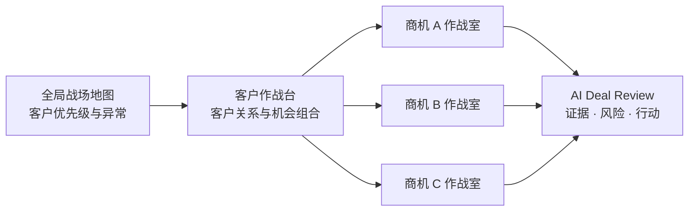

# AIStorm Command：客户作战台与商机作战室信息架构蓝图

**状态：** 待用户确认后实施  
**设计目标：** 让用户在任何页面都能明确回答三个问题：**我现在看的对象是谁？方法论依据是什么？AI 基于哪些事实给出了什么行动建议？**

## 1. 当前问题的代码级审计结论

当前 `BattleMap.tsx` 的同一客户详情区同时放入了：客户级 MEDDPICC、客户关系趋势、关键人图谱、活跃商机矩阵、Win Strategy、SPIN、效能基线和 AI Review 入口。更严重的是，MEDDPICC 标签在 0→1 阶段显示客户级评分编辑器，在进入商机后又变为多个商机的评分矩阵。这让相同标签在不同阶段代表不同对象，用户无法判断自己是在经营客户关系还是推进某条交易。

| 当前内容 | 正确归属 | 当前混乱的原因 |
|---|---|---|
| 客户阶段、产品覆盖、客户总体态势 | 客户作战台 | 与商机级评分和策略并排，层级不清 |
| 关键人图谱、组织汇报线、Buying Group 全貌 | 客户作战台 | 是客户组织资产，不属于任一单独商机 |
| 0→1 阶段门控、关系就绪度、客户发现 SPIN | 客户作战台 | 是“能否开商机”的判断，不是赢单管理 |
| 交易金额、预计签约、竞争、商机阶段 | 商机作战室 | 当前只在“活跃战线”列表内局部展示 |
| 商机 MEDDPICC、证据、评分历史 | 商机作战室 | 目前被客户级矩阵和客户级评分编辑器夹在一起 |
| Blue Sheet、Win Strategy、商机级 SPIN、行动任务 | 商机作战室 | 目前 Win Strategy 与 SPIN 以客户级标签出现，无法对应某一条具体交易 |
| 效能基线与 ROI Before State | 商机作战室 | 量化依据应服务该方案的商业价值与赢单论证 |
| AI Review、矛盾检测、下一步行动 | 商机作战室为主；客户级仅保留关系风险摘要 | 当前 AI 输出没有清晰说明其所依据的数据对象 |

## 2. 新的三层导航模型

> **全局战场地图回答“优先经营谁”；客户作战台回答“这段关系是否值得并能够开战”；商机作战室回答“这条交易能否赢、如何赢”。**

| 层级 | 页面定位 | 用户的核心问题 | 主要操作 |
|---|---|---|---|
| **全局战场地图** | 管理层和 SAM 的入口 | 哪些客户需要优先处理？ | 筛选、看风险、进入客户 |
| **客户作战台** | 一户客户的关系经营总台 | 组织关系成熟吗？产品还缺什么？有哪些可开/在打的战线？ | 建图、关系推进、查看组合、进入某一商机 |
| **商机作战室** | 一条独立交易的全屏工作台 | 这条交易会不会赢？弱点在哪？下一步由谁做什么？ | 评分、补证据、制定策略、AI Review、推进任务 |

## 3. 客户作战台：只保留客户级信息

建议使用独立路由：`/clients/:clientId`。从战场地图点击客户卡片进入；顶部必须保留“返回战场地图”出口。客户作战台不展示可编辑的商机 MEDDPICC 细节，也不在这里编辑 Blue Sheet 或 Win Strategy。

### 3.1 页面结构

| 区块 | 展示内容 | 方法论 / AI 说明 |
|---|---|---|
| **客户头部** | 客户名称、所属行业、负责人、客户阶段、最后有效接触、产品覆盖、客户总态势 | 只回答客户经营概况，不替代商机判断 |
| **关系态势** | 0→1 阶段门控、关系就绪度、客户级趋势、未满足条件 | AI 提示“为何不能进入商机”，依据关键人、拜访、痛点证据和时间线 |
| **组织与 Buying Group** | 7 人关键人图谱、汇报关系、角色、关系强度、Felix 风险标记 | 组织关系是客户资产，允许被多个商机复用 |
| **机会组合** | 每条活跃商机以独立“作战卡片”展示：产品、金额、阶段、健康度、最大风险、下一动作 | 卡片只汇总，点击“进入作战室”进入全屏商机页 |
| **客户经营时间线** | 拜访、关键人变化、情报信号、关系事件 | AI 生成客户级关系摘要，但不生成交易赢单结论 |

### 3.2 客户级信息的严格边界

1. **产品覆盖度**只在客户头部与客户作战台出现。它回答“已经覆盖什么、下一步可扩展什么”，不评价单条商机质量。
2. **客户级 MEDDPICC**在 0→1 阶段仅作为关系就绪度工具；进入 1→N 后仅显示“机会组合态势”摘要，不再提供一个看似可手填的客户级交易分数。
3. **SPIN**在客户作战台只保留“客户发现提纲”，用于 0→1 建图、进门和定痛。它不是某条交易的谈判脚本。
4. **关键人图谱**始终属于客户级；商机页只引用与该商机相关的子集，并允许标注其在该交易中的 Buying Group 角色。

## 4. 商机作战室：每条商机独立、可全屏进入

建议使用独立路由：`/clients/:clientId/opportunities/:opportunityId`。从客户机会组合中的“进入作战室”按钮进入；顶部提供“返回 HKT 客户作战台”与“上一条/下一条商机”路径。

### 4.1 全屏作战室布局

| 固定区域 | 内容 | 目的 |
|---|---|---|
| **作战室头部** | 商机名称、产品、金额、阶段、预计签约、负责人、健康度、竞争状态 | 一眼确认正在经营哪一笔交易 |
| **AI 决策条** | 最新 AI Review 结论、最大风险、置信依据、下一步行动 | 先呈现“现在该做什么”，但必须可展开查看证据 |
| **左侧方法论导航** | 战情总览、MEDDPICC 证据、Blue Sheet、Win Strategy、SPIN/拜访计划、行动任务、复盘历史 | 明确每个方法论是服务该商机的，而不是客户级杂项 |
| **右侧证据与协作抽屉** | 关联关键人子集、最近拜访、情报信号、资料包、POD 任务 | 方法论判断可回溯到事实 |

### 4.2 商机作战室的方法论与 AI 映射

| 作战室模块 | 人做什么 | AI 做什么 | AI 的事实输入 |
|---|---|---|---|
| **战情总览** | 判断是否优先投入资源 | 汇总风险、赢单机会与本周关键动作 | 商机金额、阶段、MEDDPICC、行动逾期、拜访、竞品 |
| **MEDDPICC 证据** | 选择有证据支持的行为里程碑，并补充日志 | 检测分数与拜访/关键人/时间线是否矛盾 | 评分选项、评分历史、会议纪要、关键人互动 |
| **Blue Sheet** | 填写客户目标、竞争、决策和价值主张 | 识别空白项，生成待验证假设 | 商机资料、客户图谱、竞品情报、拜访记录 |
| **Win Strategy** | 审核并采纳取胜策略 | 生成策略初稿，提出最弱维度与突破路径 | MEDDPICC、Blue Sheet、Buying Group、情报信号 |
| **SPIN / 拜访计划** | 选择问题、会前准备、会后记录事实 | 从未解决的 MEDDPICC 维度生成下一轮问题建议 | 当前评分缺口、最近拜访、角色与产品资料 |
| **行动任务** | AD/SAM/SA 领取并关闭任务 | 将 Review 结论转为可分工的候选行动 | AI Review、策略缺口、行动历史 |

> **关键原则：** AI 不能替人“填分”或直接宣布商机会赢。人负责录入和确认行为证据；AI 负责在跨记录的数据中寻找缺口、矛盾和下一步路径；AD 负责审核、分配资源和作出交易判断。

## 5. AI 必须在界面上“可解释”

每一条 AI 输出都应有统一的三段式展示，不再只给结论：

1. **结论：** 例如“EDR 的 C1 与 D2 是当前最弱维度”。
2. **依据：** 列出具体来源，如“Felix 新任 CISO 已表达异议”“近 7 天无与最终用户部门的有效接触”“决策流程仅确认到 Marcos”。
3. **建议动作：** 指明责任人、截止时间和完成标准，例如“由 SAM 在 Ray 发出信号后安排两部门汇报；由 AD 与 Marcos 对齐年底签约路径”。

这样，Demo 可以清楚讲成：**事实进入系统 → 方法论把事实组织成证据 → AI 找出矛盾和优先级 → 人执行与复核。**

## 5.1 AI 原生流程验收矩阵

> **所有关键流程都必须有 AI，但 AI 的价值不是在每个页面放一个聊天按钮。每一个 AI 组件都必须明确显示：它读取了什么事实、依据哪一种方法论做判断、建议哪个角色完成什么动作。**

| 流程 | 人的输入与责任 | AI 读取的事实 | AI 必须给出的可解释结果 | 人的下一步 |
|---|---|---|---|---|
| **客户建图** | 补充客户组织、职位、关系、公开信息和接触状态 | 关键人图谱、组织链路、客户情报、缺失角色 | 组织覆盖缺口；EB/Champion 候选人；需要验证的角色关系 | SAM/AD 补齐缺失节点，确认接触路径 |
| **0→1 阶段推进** | 录入拜访、客户原话、痛点和关系进展 | 阶段门控、拜访频率、关键人接触、客户级 MEDDPICC | 不能推进的具体原因；缺少的可验证交付物；建议下一次接触对象 | SAM 完成客户验证动作；AD 审核阶段推进 |
| **产品覆盖** | 为商机关联真实产品线 | 已关联商机、客户行业、产品组合、已覆盖能力 | 覆盖空白与可验证的扩展假设；不得把“潜在机会”写成“已签约” | SAM 选择是否建立新的机会假设 |
| **商机建立** | 明确产品、金额、客户目标、竞争和关键人 | 客户图谱、既有拜访、已覆盖产品、情报信号 | Blue Sheet 初稿；尚未验证的假设；建立该商机前需要补齐的事实 | 商机负责人确认范围和证据 |
| **MEDDPICC 评分** | 选择行为里程碑并附加证据日志 | 评分历史、拜访纪要、关键人互动、行动完成情况 | 分数与证据矛盾；证据时效风险；最需补强的维度 | SAM 补证据；AD 审核异常评分 |
| **Blue Sheet / Buying Group** | 维护客户目标、决策链、竞争和价值主张 | 关键人子集、组织关系、会议事实、竞争信息 | 未覆盖的 Buying Group 角色；决策流程空白；竞争假设待验证点 | 指派关系突破与验证任务 |
| **Win Strategy** | 审核取胜假设和资源投入 | MEDDPICC、Blue Sheet、竞争、行动进展 | 最弱维度、可能的取胜路径、需要管理层介入的事项 | AD/SAM/SA 确认策略和资源分工 |
| **SPIN 与拜访计划** | 选择会面对象与客户目标 | 未验证维度、最近会谈、角色、产品知识库 | 按 S/P/I/N 分层的下一轮问题；每个问题对应待补的 MEDDPICC 证据 | SAM 选择问题并在会后回填事实 |
| **行动任务与 Review** | 领取、执行、关闭任务，并审核 AI 输出 | AI Review、逾期任务、最新纪要、评分和情报 | 按 AD/SAM/SA 分工的行动建议；结论依据；未完成动作的经营影响 | 负责人执行；AD 复核关闭质量 |

### AI 原生界面的固定呈现规范

每一个 AI 区块都使用统一的 **“AI 作战判断”** 卡片，而不是泛化聊天框。卡片必须依次呈现：

1. **判断：** 当前最值得关注的风险、机会或下一步。
2. **事实依据：** 至少列出两条来自系统的具体记录、时间或数据状态；如果事实不足，明确写“数据不足，暂不判断”。
3. **方法论映射：** 标明其对应 MEDDPICC、Buying Group、Blue Sheet、Win Strategy 或 SPIN 的哪一项。
4. **建议行动：** 说明责任角色、动作、截止时间建议和完成标准，并允许一键生成待审核任务。
5. **人类控制：** AI 结论只能被采纳、编辑或驳回；不得直接改变评分、阶段或赢单预测。

## 5.2 HKT EDR 作为 AI 原生样板

HKT EDR 的真实经营事实适合作为第一期样板：亚信与奇安信并列第一、Marcos 路径积极、Felix 新任 CISO 存在异议、最终用户部门汇报尚待 Ray 信号。商机作战室应把这些事实拆解为以下链路：

| 事实 | 方法论归属 | AI 应显示的判断 | 可执行行动 |
|---|---|---|---|
| 亚信与奇安信并列第一 | C2 竞争态势 / Blue Sheet | 并列第一不等于赢单，需把竞争优势转为决策标准 | SA 把 EDR 差异化与用户部门验收标准对齐 |
| Marcos 支持年底签约 | E / D2 | 高层路径可用，但尚未形成跨职能共识 | AD 与 Marcos 对齐年底签约倒排路径 |
| Felix 有不同意见 | Buying Group / C1 / D | 新任 CISO 是高影响力阻碍者，且与 Marcos 关系紧张 | AD+SA 先明确 Felix 的安全顾虑与参与方式，避免绕开其决策影响 |
| 等待两个最终用户部门汇报信号 | I / D / Champion 验证 | 用户验证是将“推荐”转化为“可签约证据”的关键门槛 | SAM 跟进汇报安排，回填最终用户部门的验收反馈 |

## 6. HKT 的建议 Demo 路径

| 演示顺序 | 页面 | 要证明的点 |
|---|---|---|
| 1 | 战场地图 | HKT 是当前重点客户，进入客户作战台 |
| 2 | HKT 客户作战台 | 7 人组织图谱、产品覆盖、EDR/VP/AI Pentest 三条核心战线 |
| 3 | 点击 EDR“进入作战室” | 每条商机都独立，有金额、阶段与风险，不混在客户页 |
| 4 | EDR MEDDPICC 证据 | 并列第一、Marcos 支持、Felix 异议分别如何进入不同维度的事实证据 |
| 5 | EDR AI Deal Review | AI 如何依据事实识别 Felix 风险与最终用户部门汇报这个关键动作 |
| 6 | EDR 行动任务 | AD/SAM/SA 的具体分工与完成标准 |
| 7 | 返回 HKT 客户作战台 | 单条商机的推进如何反映为客户整体机会组合和产品覆盖变化 |

## 7. 分阶段实施与安全迁移

| 阶段 | 交付范围 | 验收标准 | 风险控制 |
|---|---|---|---|
| **A. 客户作战台骨架** | 新客户路由、客户头部、关系/关键人/机会组合 | 原客户数据完整可见；不改变评分和流程 | 旧详情暂时保留为只读回退入口 |
| **B. 商机作战室骨架** | 新商机路由、独立头部、全屏入口、返回路径 | 可从 HKT EDR 卡片进入和返回；数据一致 | 先迁移只读摘要，避免影响现有写入 |
| **C. 方法论迁移** | MEDDPICC、Blue Sheet、Win Strategy、SPIN、行动 | 每个模块只在商机上下文操作 | 每迁移一个模块即跑回归测试 |
| **D. AI 解释层** | AI Review 的结论—依据—行动三段式 | 每个 AI 结论能打开可核验的事实依据 | 没有数据时必须显示“数据不足”，不得补造 |
| **E. 下线旧混合标签栏** | 移除或降级旧详情标签 | 用户不再看到两个层级混排 | 在 HKT 真实数据上做演示验收后再下线 |

## 8. 需要用户确认的产品决策

1. 是否认可“**客户作战台 + 独立商机作战室**”作为最终主架构？
2. 是否认可 SPIN 分为“客户发现提纲（客户级）”和“商机拜访计划（商机级）”两种用途？
3. 是否认可进入 1→N 后，客户页不再编辑客户级 MEDDPICC，而只展示机会组合摘要；所有赢单评分均在独立商机作战室完成？
4. 是否以 HKT 的 EDR 商机作为第一期重构和 Demo 验收样板？
